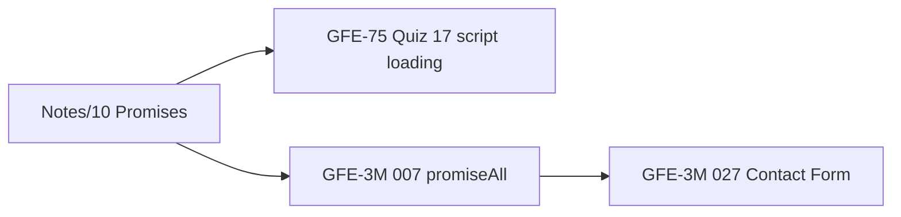

<p align="center">
  
  
  
  
</p>

<h1 align="center">Frontend-Questions-Notes</h1>

<p align="center">
  <b>Your frontend interview notebook — code, UI, quizzes, and revision notes in one graph.</b><br/>
  Solutions + study writeups aligned to <a href="https://www.greatfrontend.com">GreatFrontEnd</a> and <a href="https://devtools.tech">DevTools.tech</a> study plans.
</p>

<p align="center">
  
  
  
  
  
  
</p>

<p align="center">
  <a href="https://www.greatfrontend.com/interviews/study-plans/three-months">GFE 3-Month Plan</a> ·
  <a href="https://www.greatfrontend.com/interviews/study-plans/blind-75">GFE Blind 75</a> ·
  <a href="https://devtools.tech/dashboard/time-savers/study-plans/1-month-study-plan---lid---wu3riyr6TGPCiZvndxrm">DevTools 1-Month</a> ·
  <a href="https://github.com/arey-pranay/leetcode-solutions-n8n">leetcode-solutions-n8n</a> (DSA companion)
</p>

---

## Why this repo exists

Frontend interviews are not one skill — they are **four rooms in the same building**:

| Room | What they test | Where it lives here |
|---|---|---|
| **JavaScript / TS** | closures, `this`, promises, polyfills | [`GFE-3M/Functions`](GFE-3M/Functions) · [`GFE-75/Functions`](GFE-75/Functions) · [`Notes`](Notes) |
| **UI components** | state, forms, layout, accessibility instincts | [`GFE-3M/UI`](GFE-3M/UI) · [`GFE-75/UI`](GFE-75/UI) · [`DevTools-1M/UI`](DevTools-1M/UI) |
| **Quiz / theory** | CSS, DOM, storage, scope — spoken answers | [`GFE-75/Quiz`](GFE-75/Quiz) · [`GFE-3M/Quizzes`](GFE-3M/Quizzes) |
| **System design** | product-shaped frontend architecture | [`GFE-3M/SystemDes`](GFE-3M/SystemDes) |

This repo is the **revision layer**: working code plus notes you can re-read the night before a round. It pairs with [`leetcode-solutions-n8n`](https://github.com/arey-pranay/leetcode-solutions-n8n) for the DSA side of the same interview loop.

---

## Start here

| If you are… | Open this |
|---|---|
| On the 3-month GreatFrontEnd sprint | [`GFE-3M`](GFE-3M) |
| Doing the Blind 75 fast track | [`GFE-75`](GFE-75) |
| Sharpening DOM / utility coding | [`DevTools-1M`](DevTools-1M) |
| Revising JS fundamentals (promises, closures, `this`) | [`Notes`](Notes) |
| Preparing spoken CSS / browser answers | [`GFE-75/Quiz`](GFE-75/Quiz) |
| Practicing product UI design on paper | [`GFE-3M/SystemDes`](GFE-3M/SystemDes) |

```text
Notes (theory) ──► GFE-75/Quiz (spoken)
       │
       └──► GFE-3M/Functions (implement)
                 │
                 └──► GFE-3M/UI (ship components)
                           │
                           └──► SystemDes (design the product)
```

---

## Map of the notebook

```text
Frontend-Questions-Notes
├── GFE-3M/                 3-month GreatFrontEnd track
│   ├── Functions/          33  — JS / TS coding challenges
│   ├── UI/                  7  — React / vanilla components
│   ├── Quizzes/CSS/         1  — spoken CSS revision
│   └── SystemDes/           2  — Facebook Feed (parts 1–2)
├── GFE-75/                 Blind 75 fast track
│   ├── Functions/           3  — polyfills & type utilities
│   ├── Quiz/               11  — CSS, DOM, scope, storage…
│   └── UI/                  4  — accordion, progress bar, layout
├── DevTools-1M/            1-month DevTools.tech track
│   ├── Functions/           2  — nested resolve, employees
│   └── UI/                  1  — voting poll
└── Notes/                  18  — deep-dive interview notes (JS + React)
```

| Track | Coding | UI | Quiz / theory | System design |
|---|---:|---:|---:|---:|
| [`GFE-3M`](GFE-3M) | 33 | 7 | 1 | 2 |
| [`GFE-75`](GFE-75) | 3 | 4 | 11 | — |
| [`DevTools-1M`](DevTools-1M) | 2 | 1 | — | — |
| [`Notes`](Notes) | — | — | 18 | — |

**Languages:** TypeScript-first in `Functions/`, React (`tsx`/`jsx`) and vanilla JS in `UI/`, CSS alongside components where styling matters.

---

## Anatomy of one challenge

Coding and UI folders follow the same shape:

```text
NNN. Challenge Name/
  index.ts | index.js | index.tsx | App.jsx   # solution
  readme.md | ReadME.md                         # study guide (when present)
  styles.css                                    # UI styling (optional)
```

A typical **function** writeup (example: [`GFE-3M/Functions/002. Debounce`](GFE-3M/Functions/002.%20Debounce/readme.md)) carries:

- **1-liner to remember** — the hook you want in an interview  
- **Revision tip** — mental flow in one sentence  
- **Nuances** — why `apply` not spread, why not arrow functions, timer persistence  
- **Mental model** — when to use debounce vs throttle  

A typical **Notes** file (example: [`Notes/10. Promises.md`](Notes/10.%20Promises.md)) carries:

- Why the concept exists (event loop, single thread)  
- States, chaining, microtasks  
- `async`/`await`, `Promise.all` / `race` / `any`  
- Common mistakes and golden memory rules  

---

## Study paths

### Path A — 3 months (GreatFrontEnd)

Official plan: [GFE Three-Month Study Plan](https://www.greatfrontend.com/interviews/study-plans/three-months)

**Week rhythm**

1. Read the matching [`Notes`](Notes) topic (closures → promises → prototypes).  
2. Implement from [`GFE-3M/Functions`](GFE-3M/Functions) without peeking.  
3. Open `readme.md` and compare nuance (especially `this`, timers, generics).  
4. Ship one [`GFE-3M/UI`](GFE-3M/UI) component per week — state + CSS together.  
5. Once a month, read a [`SystemDes`](GFE-3M/SystemDes) doc out loud as if whiteboarding.

**Function spine** (ordered by GFE number — the backbone of the track):

| # | Challenge | Folder |
|---|---|---|
| 001 | Filter | [`GFE-3M/Functions/001. Filter`](GFE-3M/Functions/001.%20Filter) |
| 002 | Debounce | [`GFE-3M/Functions/002. Debounce`](GFE-3M/Functions/002.%20Debounce) |
| 003 | Classname | [`GFE-3M/Functions/003. Classname`](GFE-3M/Functions/003.%20Classname) |
| 004 | Data Selection | [`GFE-3M/Functions/004. Data Selection`](GFE-3M/Functions/004.%20Data%20Selection) |
| 005 | List Format | [`GFE-3M/Functions/005. List Format`](GFE-3M/Functions/005.%20List%20Format) |
| 006 | Flatten Array | [`GFE-3M/Functions/006. Flatten-Array`](GFE-3M/Functions/006.%20Flatten-Array) |
| 007 | promiseAll | [`GFE-3M/Functions/007. promiseAll`](GFE-3M/Functions/007.%20promiseAll) |
| 015 | MyMap | [`GFE-3M/Functions/015. MyMap`](GFE-3M/Functions/015.%20MyMap) |
| 016 | camelCaseKeys | [`GFE-3M/Functions/016. camelCaseKeys converter`](GFE-3M/Functions/016.%20camelCaseKeys%20converter) |
| 017 | DeepClone | [`GFE-3M/Functions/017. DeepClone`](GFE-3M/Functions/017.%20DeepClone) |
| 018 | Bind Polyfill | [`GFE-3M/Functions/018. Bind Polyfill`](GFE-3M/Functions/018.%20Bind%20Polyfill) |
| 019 | Get | [`GFE-3M/Functions/019. Get`](GFE-3M/Functions/019.%20Get) |
| 020 | getElementsByTagName | [`GFE-3M/Functions/020. GetElementsByTagName`](GFE-3M/Functions/020.%20GetElementsByTagName) |
| 021 | Identical DOM Trees | [`GFE-3M/Functions/021. Identical DOM Trees`](GFE-3M/Functions/021.%20Identical%20DOM%20Trees) |
| 022 | jQuery polyfill | [`GFE-3M/Functions/022. JQuery polyfill`](GFE-3M/Functions/022.%20JQuery%20polyfill) |
| 023 | Unique Array | [`GFE-3M/Functions/023. Unique Array`](GFE-3M/Functions/023.%20Unique%20Array) |
| 024 | Text Search | [`GFE-3M/Functions/024. Text Search`](GFE-3M/Functions/024.%20Text%20Search) |
| 025 | Throttle | [`GFE-3M/Functions/025. Throttle`](GFE-3M/Functions/025.%20Throttle) |
| 030 | Array.prototype.reduce | [`GFE-3M/Functions/030. Array.protype.reduce`](GFE-3M/Functions/030.%20Array.protype.reduce) |
| 031 | getElementsByClassName | [`GFE-3M/Functions/031. getElementsByClassname`](GFE-3M/Functions/031.%20getElementsByClassname) |
| 032 | DeepClone (II) | [`GFE-3M/Functions/032. DeepClone`](GFE-3M/Functions/032.%20DeepClone) |
| 033 | Curry | [`GFE-3M/Functions/033. Curry`](GFE-3M/Functions/033.%20Curry) |
| 034 | Curry II | [`GFE-3M/Functions/034. Curry - II`](GFE-3M/Functions/034.%20Curry%20-%20II) |
| 035 | promise.allSettled | [`GFE-3M/Functions/035. promise.allSettled Polyfill`](GFE-3M/Functions/035.%20promise.allSettled%20Polyfill) |
| 036 | jQuery class manipulation | [`GFE-3M/Functions/036. jquery class manipulation`](GFE-3M/Functions/036.%20jquery%20class%20manipulation) |
| 037 | Promise.any | [`GFE-3M/Functions/037. Promise.any polyfill (understood)`](GFE-3M/Functions/037.%20Promise.any%20polyfill%20(understood)) |
| 038 | Squash Object | [`GFE-3M/Functions/038. Squash Object`](GFE-3M/Functions/038.%20Squash%20Object) |
| 039 | Sum | [`GFE-3M/Functions/039. Sum`](GFE-3M/Functions/039.%20Sum) |
| 040 | Table Of Contents | [`GFE-3M/Functions/040. Table Of Contents`](GFE-3M/Functions/040.%20Table%20Of%20Contents) |
| 041 | TextSearch 2 | [`GFE-3M/Functions/041. TextSearch 2`](GFE-3M/Functions/041.%20TextSearch%202) |
| 042 | JSON Stringify | [`GFE-3M/Functions/042. JSON Stringify`](GFE-3M/Functions/042.%20JSON%20Stringify) |

**UI components**

| # | Component | Stack |
|---|---|---|
| 008 | Counter | [`index.tsx`](GFE-3M/UI/008.%20Counter/index.tsx) |
| 009 | Todo | [`index.tsx`](GFE-3M/UI/009.%20Todo/index.tsx) + [readme](GFE-3M/UI/009.%20Todo/readme.md) |
| 010 | TweetCard | [`index.tsx`](GFE-3M/UI/010.%20TweetCard/index.tsx) + [styles](GFE-3M/UI/010.%20TweetCard/styles.css) |
| 011 | Holy Grail | [`index.jsx`](GFE-3M/UI/011.%20Holy%20Grail/index.jsx) + [readme](GFE-3M/UI/011.%20Holy%20Grail/readme.md) |
| 012 | Temperature Converter | [`index.js`](GFE-3M/UI/012.%20Temperature%20Converter/index.js) |
| 026 | Star Rating | [`App.js`](GFE-3M/UI/026.%20Star%20Rating/App.js) + [StarRating.js](GFE-3M/UI/026.%20Star%20Rating/StarRating.js) |
| 027 | Contact Form | [`App.js`](GFE-3M/UI/027.%20Contact%20Form/App.js) + [submitForm.js](GFE-3M/UI/027.%20Contact%20Form/submitForm.js) |

**System design**

- [`013. Facebook Feed — Part 1`](GFE-3M/SystemDes/013.%20Facebook%20Feed-Part%201.md)
- [`013. Facebook Feed — Part 2`](GFE-3M/SystemDes/013.%20Facebook%20Feed-Part%202.md)

---

### Path B — Blind 75 (fast track)

| Kind | Items |
|---|---|
| Functions | [`03. Prototype.call() Polyfill`](GFE-75/Functions/03.%20Prototype.call()%20Polyfill) · [`08. Array.reduce() PolyFill`](GFE-75/Functions/08.%20Array.reduce()%20PolyFill.md) · [`09. Type Utilities`](GFE-75/Functions/09.%20Type%20Utilities%20(Objects,%20Functions,%20etc)) |
| UI | [`04. ContactForm`](GFE-75/UI/04.%20ContactForm.md) · [`05. Accordion`](GFE-75/UI/05.%20Accordion) · [`06. HolyGrail`](GFE-75/UI/06.%20HolyGrail.md) · [`07. Dynamic Progress Bar`](GFE-75/UI/07.%20Dynamic%20Progress%20Bar) |
| Quiz | See [quiz index](#gfe-75-quiz--spoken-answers) below |

---

### Path C — DevTools 1 month

Plan link: [DevTools.tech 1-Month Study Plan](https://devtools.tech/dashboard/time-savers/study-plans/1-month-study-plan---lid---wu3riyr6TGPCiZvndxrm)

| # | Challenge | Type |
|---|---|---|
| 262 | Resolve Function for Nested Objects | [`Functions`](DevTools-1M/Functions/262.%20Resolve%20Function%20for%20Nested%20Objects) |
| 265 | Find Employees | [`Functions`](DevTools-1M/Functions/265.%20Find%20Employees) |
| 257 | Voting Poll | [`UI`](DevTools-1M/UI/257.%20Voting%20Poll) |

---

### Path D — Foundation notes (read before coding)

These are the **spoken-interview backbone**. Read in order once, then revisit before any onsite.

| # | Topic | File |
|---|---|---|
| 01 | `hasOwnProperty` vs `hasOwn()` | [`Notes/01. hasOwnProperty and hasOwn() .md`](Notes/01.%20hasOwnProperty%20and%20hasOwn()%20.md) |
| 02 | Traversing (DOM / trees) | [`Notes/02. traversing.md`](Notes/02.%20traversing.md) |
| 03 | Data structures | [`Notes/03. dataStructures.md`](Notes/03.%20dataStructures.md) |
| 04 | Logical operators & short-circuiting | [`Notes/04. Logical Operators and Short Circuiting.md`](Notes/04.%20Logical%20Operators%20and%20Short%20Circuiting.md) |
| 05 | Closures & callbacks | [`Notes/05. Closures and Callbacks and related.md`](Notes/05.%20Closures%20and%20Callbacks%20and%20related.md) |
| 06 | Browser internals & async JS | [`Notes/06. Browser Internals and Async processes in js.md`](Notes/06.%20Browser%20Internals%20and%20Async%20processes%20in%20js.md) |
| 07 | Polyfills, prototypes, inheritance | [`Notes/07. Polyfills, Prototypes and js-Inheritance.md`](Notes/07.%20Polyfills,%20Prototypes%20and%20js-Inheritance.md) |
| 08 | Type coercion & equality | [`Notes/08. Type Coercion and equality checks.md`](Notes/08.%20Type%20Coercion%20and%20equality%20checks.md) |
| 09 | Spread, rest, shallow/deep copy | [`Notes/09. Spread and Rest and Shallow-Deep Copies.md`](Notes/09.%20Spread%20and%20Rest%20and%20Shallow-Deep%20Copies.md) |
| 10 | Promises (deep dive) | [`Notes/10. Promises.md`](Notes/10.%20Promises.md) |
| 11 | Promise states & methods | [`Notes/11. Promise States and Func - Resolve, Reject, Then, Catch.md`](Notes/11.%20Promise%20States%20and%20Func%20-%20Resolve,%20Reject,%20Then,%20Catch.md) |
| 12 | Returns, brackets, grouping | [`Notes/12. Returns Brackets and Grouping.md`](Notes/12.%20Returns%20Brackets%20and%20Grouping.md) |
| 13 | Call, bind, apply | [`Notes/13. Call, Bind, Apply etc.md`](Notes/13.%20Call,%20Bind,%20Apply%20etc.md) |
| 14 | Traversals, types, objects | [`Notes/14. Traversals and Types and Objects.md`](Notes/14.%20Traversals%20and%20Types%20and%20Objects.md) |
| 15 | Closures, chaining, factories | [`Notes/15. Closures, Chaining, Factory Functions.md`](Notes/15.%20Closures,%20Chaining,%20Factory%20Functions.md) |
| 16 | Form data & HTML inputs | [`Notes/16. Form Data and HTML inputs.md`](Notes/16.%20Form%20Data%20and%20HTML%20inputs.md) |
| 17 | React `useEffect` — when / when not | [`Notes/17. [react] useEffect - when not to use and when to use.md`](Notes/17.%20%5Breact%5D%20useEffect%20-%20when%20not%20to%20use%20and%20when%20to%20use.md) |
| 18 | Storage comparisons | [`Notes/18. Storage Comparisons.md`](Notes/18.%20Storage%20Comparisons.md) |

---

## Cross-track connections

The same idea often appears in **Notes → Quiz → Function → UI**. Follow the thread:



| Concept | Theory | Spoken | Code |
|---|---|---|---|
| Closures | [`Notes/05`](Notes/05.%20Closures%20and%20Callbacks%20and%20related.md) | [`Quiz/18`](GFE-75/Quiz/18.%20Closures%20and%20Lexical%20Environment%20(Scope).md) | [`033 Curry`](GFE-3M/Functions/033.%20Curry) |
| Promises | [`Notes/10`](Notes/10.%20Promises.md) | [`Quiz/17`](GFE-75/Quiz/17.%20script%20-%3E%20defer,%20async%20and%20module.md) | [`007 promiseAll`](GFE-3M/Functions/007.%20promiseAll) |
| `this` / bind | [`Notes/13`](Notes/13.%20Call,%20Bind,%20Apply%20etc.md) | — | [`018 Bind`](GFE-3M/Functions/018.%20Bind%20Polyfill) · [`GFE-75 call`](GFE-75/Functions/03.%20Prototype.call()%20Polyfill) |
| DOM traversal | [`Notes/02`](Notes/02.%20traversing.md) | [`Quiz/15`](GFE-75/Quiz/15.%20Event%20Delegation.md) · [`Quiz/19`](GFE-75/Quiz/19.%20Event%20Bubbling.md) | [`021 DOM Trees`](GFE-3M/Functions/021.%20Identical%20DOM%20Trees) |
| Storage | [`Notes/18`](Notes/18.%20Storage%20Comparisons.md) | [`Quiz/16`](GFE-75/Quiz/16.%20Cookies,%20local,%20session.md) | — |
| Forms | [`Notes/16`](Notes/16.%20Form%20Data%20and%20HTML%20inputs.md) | — | [`027 Contact Form`](GFE-3M/UI/027.%20Contact%20Form) |
| Layout | — | [`Quiz/12–13`](GFE-75/Quiz/12.%20CSS%20display%20properties.md) | [`011 Holy Grail`](GFE-3M/UI/011.%20Holy%20Grail) |
| Deep clone | [`Notes/09`](Notes/09.%20Spread%20and%20Rest%20and%20Shallow-Deep%20Copies.md) | — | [`017`](GFE-3M/Functions/017.%20DeepClone) · [`032`](GFE-3M/Functions/032.%20DeepClone) |

---

## GFE-75 Quiz — spoken answers

| # | Topic | File |
|---|---|---|
| 01 | Inline vs block vs inline-block | [`GFE-75/Quiz/01. Inline vs Block vs Inline-Block.md`](GFE-75/Quiz/01.%20Inline%20vs%20Block%20vs%20Inline-Block.md) |
| 02 | `null` vs `undefined` vs undeclared | [`GFE-75/Quiz/02. Null vs Undefined vs Undeclared.md`](GFE-75/Quiz/02.%20Null%20vs%20Undefined%20vs%20Undeclared.md) |
| 10–11 | Box model | [`GFE-75/Quiz/10, 11. Box Model.md`](GFE-75/Quiz/10,%2011.%20Box%20Model.md) |
| 12 | CSS `display` | [`GFE-75/Quiz/12. CSS display properties.md`](GFE-75/Quiz/12.%20CSS%20display%20properties.md) |
| 13 | CSS position | [`GFE-75/Quiz/13. CSS Position.md`](GFE-75/Quiz/13.%20CSS%20Position.md) |
| 14 | `var` / `let` / `const` | [`GFE-75/Quiz/14. Comparing var,let,const.md`](GFE-75/Quiz/14.%20Comparing%20var,let,const.md) |
| 15 | Event delegation | [`GFE-75/Quiz/15. Event Delegation.md`](GFE-75/Quiz/15.%20Event%20Delegation.md) |
| 16 | Cookies, `localStorage`, `sessionStorage` | [`GFE-75/Quiz/16. Cookies, local, session.md`](GFE-75/Quiz/16.%20Cookies,%20local,%20session.md) |
| 17 | `<script>` defer / async / module | [`GFE-75/Quiz/17. script -> defer, async and module.md`](GFE-75/Quiz/17.%20script%20-%3E%20defer,%20async%20and%20module.md) |
| 18 | Closures & lexical scope | [`GFE-75/Quiz/18. Closures and Lexical Environment (Scope).md`](GFE-75/Quiz/18.%20Closures%20and%20Lexical%20Environment%20(Scope).md) |
| 19 | Event bubbling | [`GFE-75/Quiz/19. Event Bubbling.md`](GFE-75/Quiz/19.%20Event%20Bubbling.md) |

**GFE-3M quiz:** [`GFE-3M/Quizzes/CSS/01. Box Model.md`](GFE-3M/Quizzes/CSS/01.%20Box%20Model.md)

---

## How to use a challenge in 15 minutes

1. **Hide** `readme.md`. Restate the API and edge cases out loud.  
2. Implement in `index.ts` / `index.tsx` — timebox 12 minutes for functions, 25 for UI.  
3. Unhide the writeup. Diff your approach against the nuance section.  
4. If a [`Notes`](Notes) file covers the same topic, read only the **2-line revision** at the bottom.  
5. For UI, resize the window and tab through controls — accessibility is part of the answer.

---

## Clone

```bash
git clone https://github.com/arey-pranay/Frontend-Questions-Notes.git
cd Frontend-Questions-Notes
```

> **Windows note:** one quiz filename contains `->` (`GFE-75/Quiz/17. script -> defer, async and module.md`), which Windows treats as invalid. Clone on macOS/Linux, use WSL, or read that file on GitHub. Everything else checks out normally.

No monorepo build step — open a folder in your editor and run the entry file (or paste into the GreatFrontEnd / DevTools runner).

---

## Conventions

- Folders are numbered to match **GreatFrontEnd / DevTools** question IDs (`002. Debounce`, `257. Voting Poll`).  
- `readme.md` vs `ReadME.md` — same role; casing varies by folder.  
- TypeScript in `Functions/`, React or vanilla in `UI/` — follow the existing file in each folder.  
- [`Notes`](Notes) are platform notes, not tied to a single GFE number — they are the theory layer under everything.

---

## Contributing

```text
Track/Category/NNN. Challenge Name/
  index.ts | index.tsx | App.jsx
  readme.md
```

Add the **1-liner**, **mental model**, and **nuance** sections for functions; link to a [`Notes`](Notes) file when the theory already exists.

---

<p align="center">
  <sub>Frontend room + DSA room. Pair with <a href="https://github.com/arey-pranay/leetcode-solutions-n8n">leetcode-solutions-n8n</a> for the full loop.</sub>
</p>
